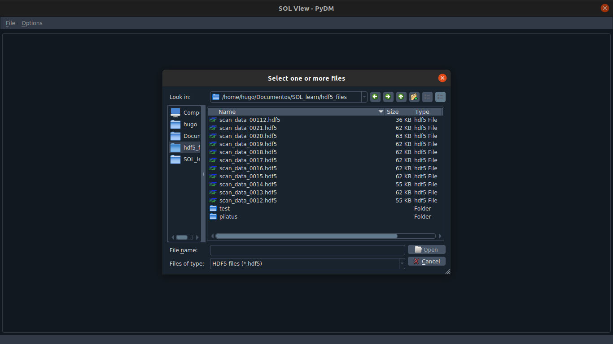

# sol-view
## A GUI to facilitate the plot of data stored in hdf5 files

To begin with, install all dependencies:

```
pip install -r requirements.txt
```

To launch the GUI, just run sol_view.py:

```
./sol_view.py
```


Press ctrl+O to open a file or go to to File > Open File.



After opening a file, the plot window will be shown. Use the checkboxes to select the things you want to see in the graphic.


You can also open several files in the same plot. To do that, hold ctrl and select the files you want:


Select a displayed curve to get statistics from it:


There is an added functionality that can perform derivative in all displayed curves. Note that new functionalities can be implemented.

