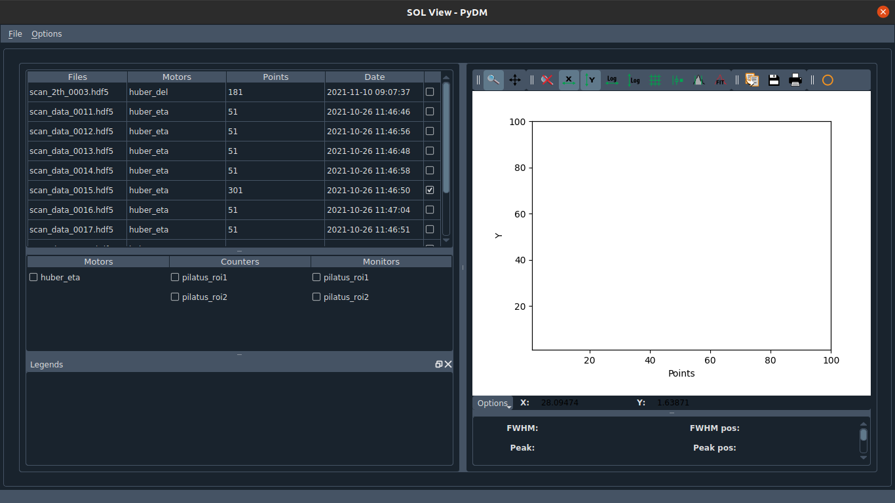
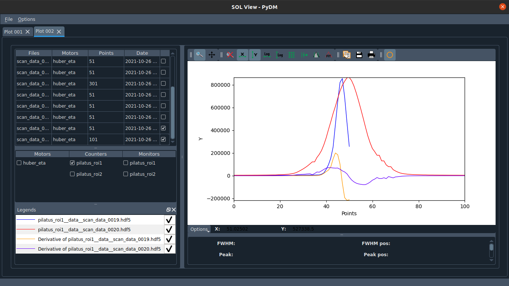

# sol-view
## A GUI to facilitate the plot of data stored in hdf5 files

To begin with, install all dependencies:

```
pip install -r requirements.txt
```

To launch the GUI, just run sol_view.py:

```
./sol_view.py
```


Press ctrl+O or click in "Open File" to open a file. You can select one or several files.


After opening a file, the main window will be shown. The table in the left side displays all the hdf5 files that are in same Dir as the one that you opened. You can use the table to sort the files by name, used motors, number of points and date. You can also open the other files if you check the checkboxes in the right side of the table.



To open several files at once, you can either select them in the file dialog or select all the files you want and press enter in the table. For instance, you could press Ctrl+a (select all) and then press ENTER to open all files in the current Dir, to close all, press ESC instead.


The GUI will work in tab mode if you go to File > Open and open another file:


Select a displayed curve to get statistics from it:


There is an added functionality that can perform derivative in all displayed curves. Note that new functionalities can be implemented.

